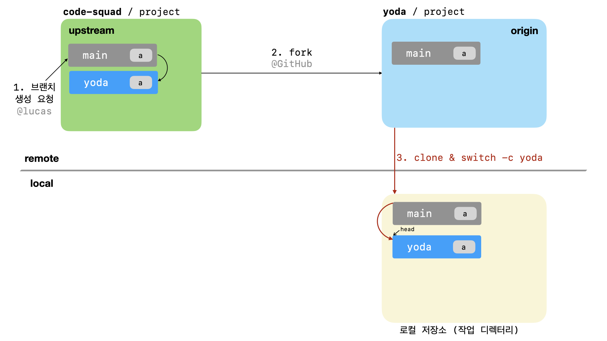
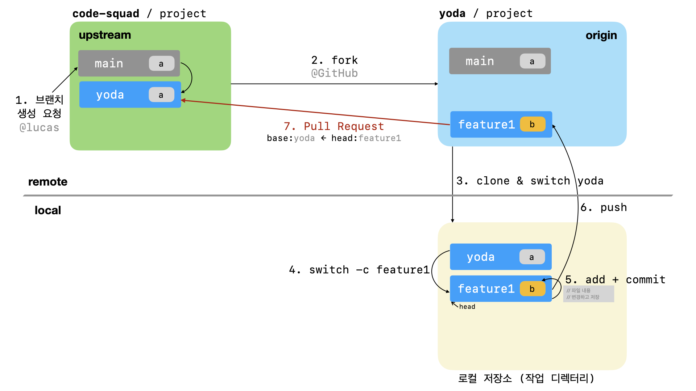
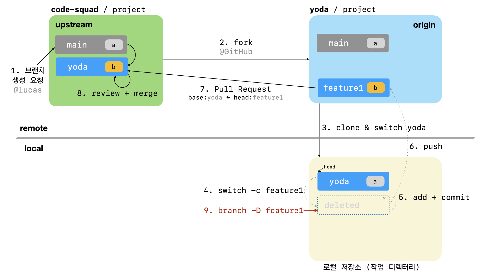
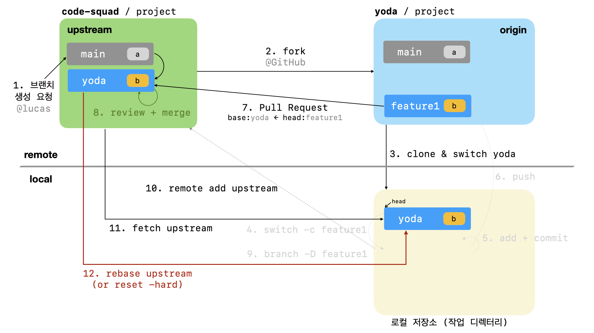
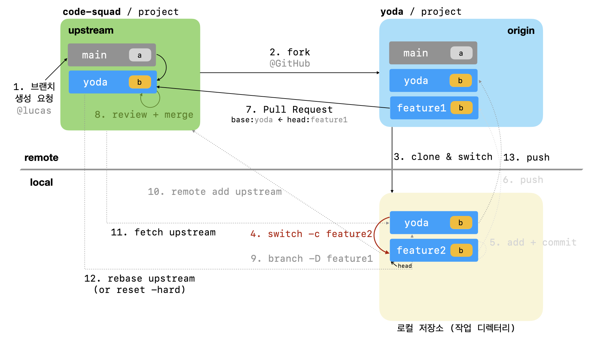

# 텍스트와 이미지로 살펴보는 코드스쿼드 온라인 코드 리뷰 과정 

- 최종수정: 2023년 1월 30일
- 이 가이드는 자동 PR merge 되는 저장소를 기반으로 한 코드 리뷰 과정을 설명하는 문서이다.

## 브랜치 생성 및 포크

1. 저장소 브랜치에 자신의 닉네임(아이디)에 해당하는 브랜치가 있는지 확인하고 
Lucas에서 브랜치 생성 버튼을 클릭하고 닉네임으로 브랜치를 생성한다.


2. 프로젝트를 자신의 계정으로 fork한다. 저장소 우측 상단의 fork 버튼을 활용한다.


## 저장소 클론

3. fork한 프로젝트를 자신의 컴퓨터로 clone한 후 디렉토리로 이동한다.

```bash
# git clone -b {본인_아이디} --single-branch https://github.com/{본인_아이디}/{저장소 아이디}
$ git clone -b yoda --single-branch https://github.com/yoda/project
```

```bash
# cd {저장소 아이디}
$ cd project
```




## 새로운 브랜치 생성

4. 기능 구현을 위한 브랜치를 생성한다.

```bash
# git switch -c {브랜치_이름}
$ git switch -c feature1
```


5. 기능 구현 후 add, commit

```bash
$ git status #확인
$ git rm 파일명 #삭제된 파일
$ git add 파일명 # (or * 모두)  #ex) git add . (변화가 있는 모든 파일 반영은 .(dot)을 사용
$ git commit -m "메시지" // 커밋
```


## Origin 저장소에 올리기

6. push 명령으로 본인 원격 저장소(Origin) 에 업로드한다.

```bash
# git push origin {브랜치_이름}
$ git push origin feature1
```


## Pull Request 보내기

7.  GitHub 서비스에서 pull request를 보낸다.

> pull request는 원본 저장소(upstream)의 브랜치를 기준으로 앞 단계에서 생성한 브랜치 차이를 비교하도록 요청한다.

```
ex) code-squad/project yoda 브랜치를 base로 <= yoda/project feature1 브랜치와 비교하기
```



## PR Merge  및 기능 브랜치 제거

8. PR은 자동으로 머지되므로 실패했을 경우 문제점을 찾아서 해결한다.


9. merge를 완료했다는 통보를 받으면 브랜치 변경 및 작업 브랜치 삭제(option)한다.

```bash
# git switch 본인_아이디
$ git switch yoda
# git branch -D {삭제할_브랜치_이름}
$ git branch -D feature1
```



## 원본 저장소(upstream) 등록 (최초 1회만)

10. merge한 codesquad 저장소:브랜치를 동기화하기 위해 codesquad 저장소의 자기 브랜치 추가하기 

> remove -v 명령으로 확인해보고 최초 한번만 `upstream`으로 등록한다

```bash
#git remote add -t {본인_아이디} {저장소_별칭} base_저장소_url
ex) git remote add -t yoda upstream https://github.com/code-squad/project.git
// 위와 같이 codesquad 저장소를 추가한 후 전체 remote 저장소 목록을 본다.
git remote -v
```


## 업스트림 저장소 갱신

11. codesquad 저장소에서 자기 브랜치 정보 가져오기

```
git fetch upstream {본인_아이디}
ex) git fetch upstream yoda
```


## 내 브랜치와 동기화

12. codesquad 리모트(upstream) 저장소 브랜치와 동기화하기

```
git rebase upstream/본인_아이디
ex) git rebase upstream/yoda
```




13. 리모트 오리진(origin) 저장소 브랜치에 올리기

```
git push origin {본인_아이디}
ex) git push origin yoda
```


## 반복작업 진행

14. 4단계부터 다시 진행한다. 또한 피드백 내용을 반영할 필요가 있을 경우 이를 반영한다.




## 동영상으로 살펴보는 코드스쿼드의 온라인 코드 리뷰 과정

[github을 기반으로한 온라인 코드 리뷰 방법](https://youtu.be/a5c9ku-_fok)