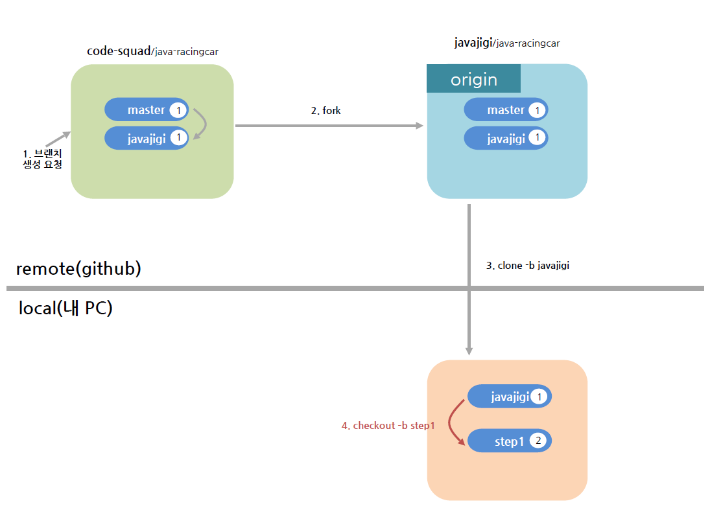
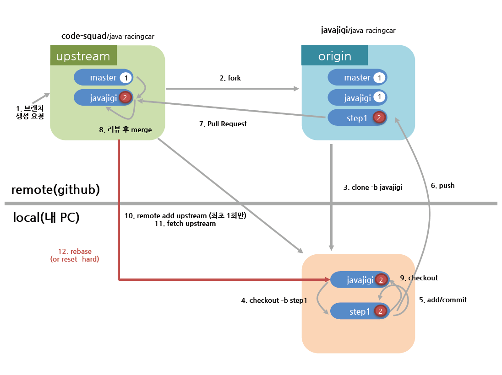

## 텍스트와 이미지로 살펴보는 코드스쿼드의 온라인 코드 리뷰 과정

----
1. 저장소 브랜치에 자신의 github 아이디에 해당하는 브랜치가 있는지 확인한다. 브랜치가 없는 경우 마스터에게 브랜치 생성을 요청한다.


----
2. 프로젝트를 자신의 계정으로 fork한다. 저장소 우측 상단의 fork 버튼을 활용한다.


----
3. fork한 프로젝트를 자신의 컴퓨터로 clone한 후 디렉토리로 이동한다.
```
git clone -b {본인_아이디} --single-branch https://github.com/{본인_아이디}/{저장소 아이디}
ex) git clone -b javajigi --single-branch https://github.com/javajigi/java-racingcar
```
```
cd {저장소 아이디}
ex) cd java-racingcar
```


----
4. 기능 구현을 위한 브랜치 생성
```
git checkout -b 브랜치이름
ex) git checkout -b step1
```



----
5. 기능 구현 후 add, commit
```
git status //확인
git rm 파일명 //삭제된 파일
git add 파일명(or * 모두) // ex) git add . (변화가 있는 모든 파일 반영은 .(dot)을 사용
git commit -m "메시지" // 커밋
```


----
6. 본인 원격 저장소에 올리기
```
git push origin 브랜치이름
ex) git push origin step1
```


----
7.  github 서비스에서 pull request를 보낸다.
> pull request는 original 저장소의 브랜치(자신의 github 아이디)와 앞 단계에서 생성한 브랜치 이름을 기준으로 한다.
> pull request를 통해 피드백을 받으면 코드를 수정한 후 같은 브랜치에 add, commit, push 작업을 반복한다.
```
ex) code-squad/java-racingcar javajigi 브랜치 기준 => javajigi/java-racingcar step1
```


----
8. 리뷰어는 피드백을 마무리하고 codesquad 저장소로 merge한다.


----
9. merge를 완료했다는 통보를 받으면 브랜치 변경 및 작업 브랜치 삭제(option)한다.
```
git checkout 본인_아이디
git branch -D 삭제할_브랜치이름
ex) git checkout javajigi
ex) git branch -D step1
```


----
10. merge한 codesquad 저장소와 동기화하기 위해 codesquad 저장소의 자기 브랜치 추가(최초 한번만)
```
git remote add -t {본인_아이디} {저장소_별칭} base_저장소_url
ex) git remote add -t javajigi upstream https://github.com/code-squad/java-racingcar.git
// 위와 같이 codesquad 저장소를 추가한 후 전체 remote 저장소 목록을 본다.
git remote -v
```

----
11. codesquad 저장소에서 자기 브랜치 가져오기(또는 갱신하기)
```
git fetch upstream {본인_아이디}
ex) git fetch upstream javajigi
```


----
12. codesquad 저장소 브랜치와 동기화하기
```
git rebase upstream/본인_아이디
ex) git rebase upstream/javajigi
```



----
13. 4단계부터 다시 진행


----
## 동영상으로 살펴보는 코드스쿼드의 온라인 코드 리뷰 과정
[github을 기반으로한 온라인 코드 리뷰 방법](https://youtu.be/a5c9ku-_fok)
