# 텍스트와 이미지로 살펴보는 코드스쿼드 온라인 코드 리뷰 과정 

- 최종수정: 2023년 1월 30일
- 이 가이드는 코드 리뷰어와 피드백을 주고받으며 PR을 완성하는 일반적인 리뷰 과정을 설명하는 문서이다
- 내 닉네임(아이디)과 깃헙 계정은 동일하게 `yoda`를 기준으로, 저장소는 `project`를 기준으로 설명한다

## 𝔸. 브랜치 생성 및 포크

1. 깃헙 프로젝트 저장소에 자신의 닉네임(아이디)에 해당하는 브랜치가 있는지 확인한다. 
브랜치 생성하려면 Lucas에서 브랜치 생성 버튼을 클릭하고 `{본인_아이디}`으로 생성한다.

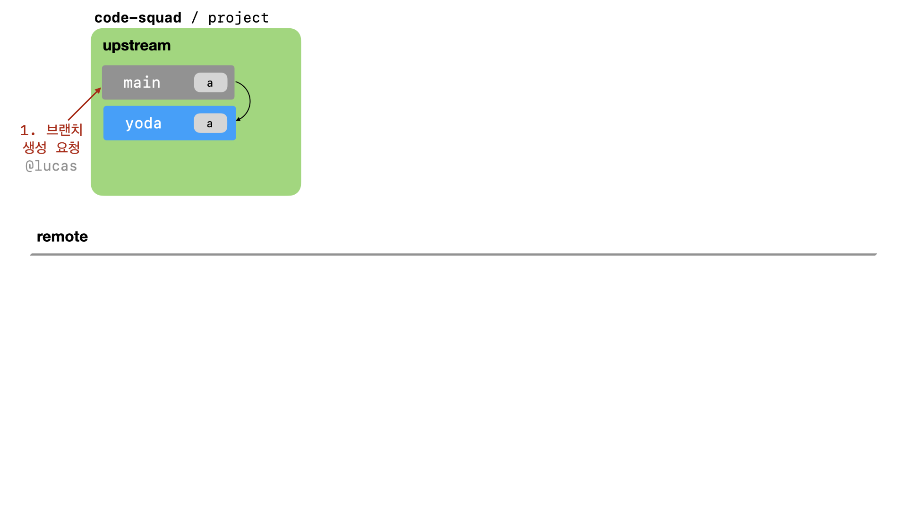


2. 프로젝트를 자신의 계정으로 fork한다. 저장소 우측 상단의 fork 버튼을 활용한다.

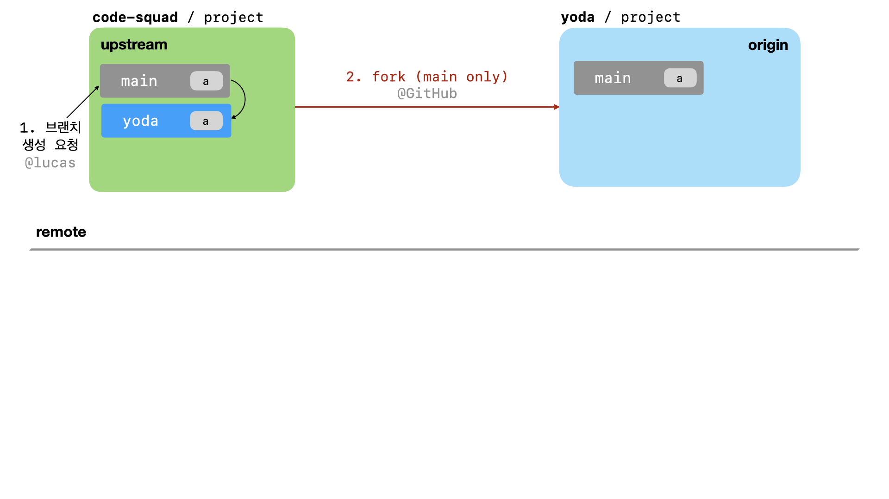


## 𝔹. 저장소 클론

3. fork한 프로젝트를 자신의 컴퓨터로 clone한 후 디렉토리로 이동한다.

```bash
# git clone -b {아이디_브랜치_이름} --single-branch https://github.com/{본인_아이디}/{저장소 아이디}
$ git clone -b yoda --single-branch https://github.com/yoda/project
```

```bash
# cd {저장소_아이디}
$ cd project
```

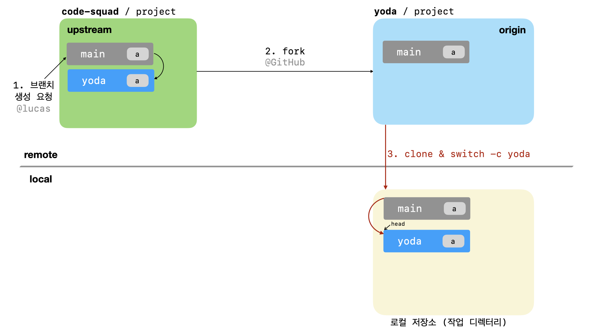


## ℂ. 새로운 브랜치 생성하고 작업하기

4. 기능 구현을 위한 브랜치를 생성한다.

```bash
# git switch -c {작업_브랜치_이름}
$ git switch -c feature1
```

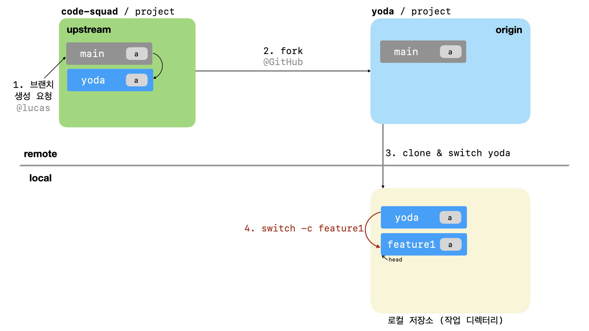


5. 기능 구현 후 add, commit

```bash
$ git status #확인
$ git rm {파일명} #삭제된 파일
$ git add {파일명} #추가하거나 변경한 파일
# ex) git add . (변화가 있는 모든 파일 반영은 .(dot)을 사용)
$ git commit -m "커밋 설명 메시지" // 커밋남기기
```


## 𝔻. 리모트 Origin 저장소에 올리기

6. push 명령으로 본인 원격 저장소(Origin)에 업로드한다.

```bash
# git push origin {작업_브랜치_이름}
$ git push origin feature1
```

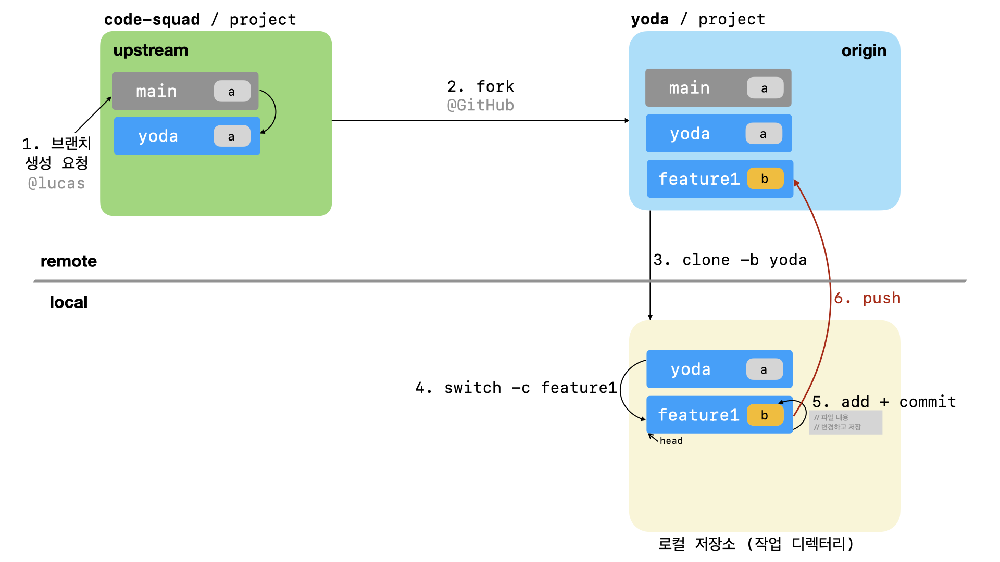


## 𝔼. Pull Request 보내기

7.  GitHub 서비스에서 pull request를 보낸다

> pull request는 원본 저장소(upstream)의 브랜치를 기준으로 앞 단계에서 생성한 브랜치 차이를 비교하도록 요청한다.

```
ex) code-squad/project yoda 브랜치를 base로 <= yoda/project feature1 브랜치와 비교하기
```


## 𝔽. PR 리뷰 승인과 머지 후 작업 브랜치 제거

8. 리뷰어는 리모트(upstream) 저장소에서 PR 리뷰를 마무리하고 승인(approved)한다.
승인되기 이전에 변경할 사항이 있으면 PR을 열어놓은 상태에서 작업 브랜치에 계속 커밋하고 푸시한다.

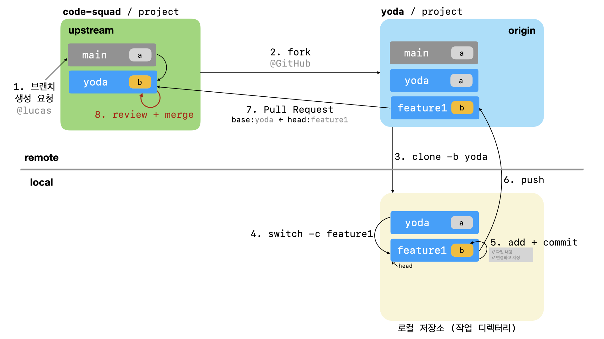

9. merge를 완료했다는 통보를 받으면 head 브랜치를 변경하고 작업 브랜치를 삭제한다

```bash
# git switch {아이디_브랜치_이름}
$ git switch yoda
# git branch -D {삭제할_브랜치_이름}
$ git branch -D feature1
```

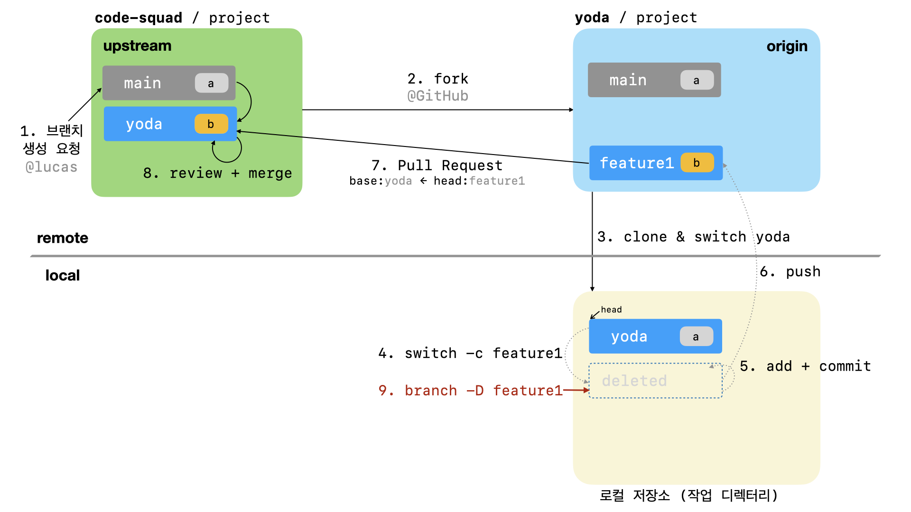

## 𝔾. 원본 저장소(upstream) 최초 등록

10. merge한 codesquad 저장소:브랜치를 동기화하기 위해 codesquad 저장소의 자기 브랜치 추가하기 

> remove -v 명령으로 확인해보고 최초 한번만 `upstream`으로 등록한다

```bash
# git remote add -t {아이디_브랜치_이름} {저장소_별칭} base_저장소_url
$ git remote add -t yoda upstream https://github.com/code-squad/project.git
# 위와 같이 codesquad 저장소를 추가한 후 전체 remote 저장소 목록을 확인한다
$ git remote -v
```

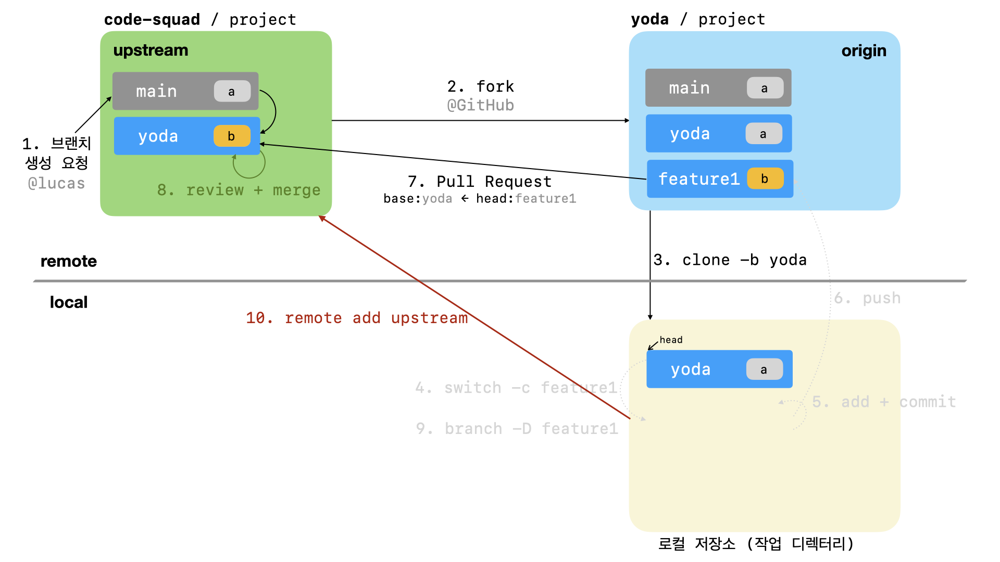

## ℍ. 업스트림 저장소와 브랜치 정보 갱신

11. codesquad 저장소에서 자기 브랜치 정보 가져오기

```bash
# git fetch upstream {아이디_브랜치_이름}
$ git fetch upstream yoda
```

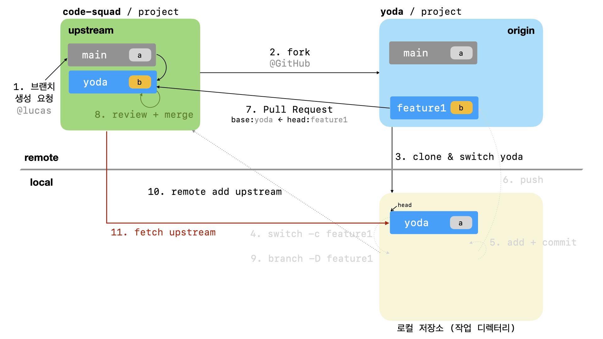


## 𝕀. 내 브랜치 동기화

12. codesquad 리모트(upstream) 저장소 브랜치와 동기화하기

```bash
# git rebase upstream/{아이디_브랜치_이름}
$ git rebase upstream/yoda
```

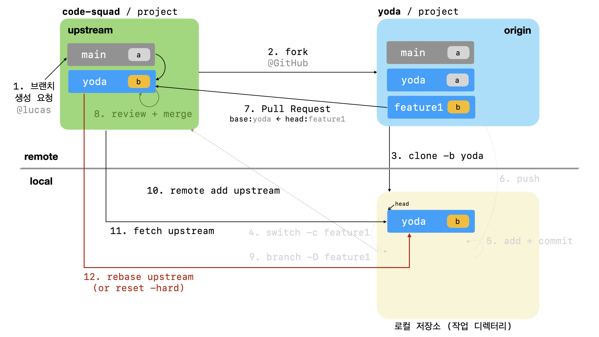

13. 리모트 오리진(origin) 저장소 브랜치에 올리기

```bash
# git push origin {아이디_브랜치_이름}
$ git push origin yoda
```

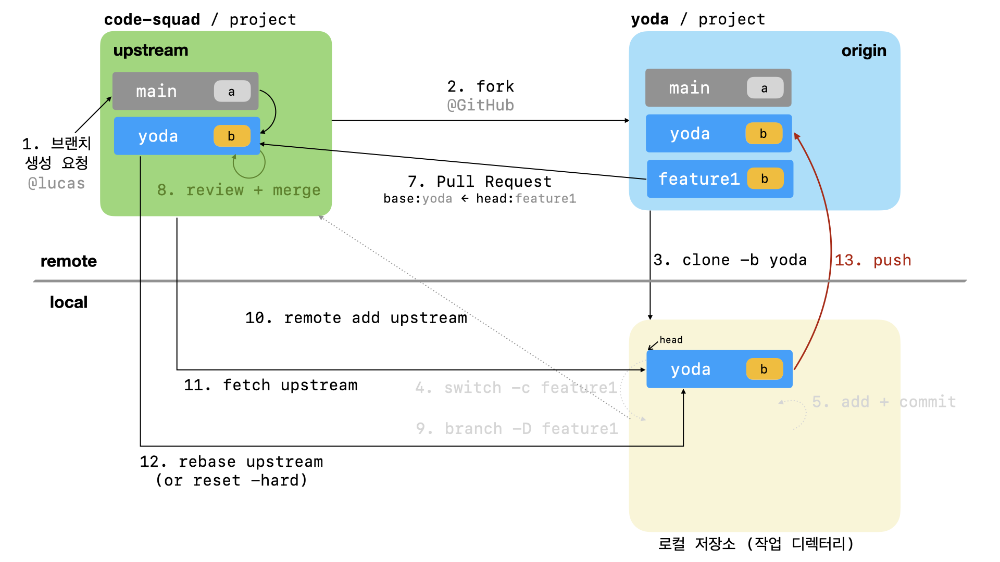

## 𝕁. 반복작업 진행

14. 4단계부터 다시 진행한다. 또한 피드백 내용을 반영할 필요가 있을 경우 이를 반영하고 다시 PR을 준비한다.


## 동영상으로 살펴보는 코드스쿼드의 온라인 코드 리뷰 과정

[github을 기반으로한 온라인 코드 리뷰 방법](https://youtu.be/a5c9ku-_fok)